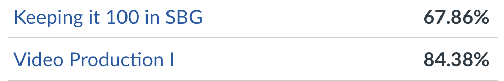

Canvas is now supporting Raw grades allowing to display in a x/4 and a letter.  
View all grades pages still only display a percentage (SBG to percent with no translation layer).  
This means when a B (2.5/4 - 3.24/4) is in percent (62.5 - 81) and then translated to letter to it becomes B to D.

Since SBG is a diffrent grading system to traditional, SBG% != %.  
Instead to translate from SBG% to letter use the table for SBL percent -> letter.

# CanSBG
SBL grades for view all grades on Canvas

## SBL -> letter
- A  =  3.25  -  4.0
- B  =  2.5   -  3.24
- C  =  2.0   -  2.49
- D  =  1.5   -  1.99
- F  =  0     -  1.49

## percent -> letter / This is what Canvas is using
- A  =  90.0  -  100.0
- B  =  80.0  -  89.9
- C  =  70.0  -  79.9
- D  =  60.0  -  69.9
- F  =  0     -  60.0

## SBL percent -> letter / This is what we want displayed (incomplete scale, needs to be fixed)
- A  =  81.25 -  100
- B  =  62.5  -  81
- C  =  50    -  62.25
- D  =  37.5  -  49.75
- F  =  0     -  37.25

non-SBL  
67.86 -> D  
84.38 -> B

SBL  
67.86 -> B  
84.38 -> A
